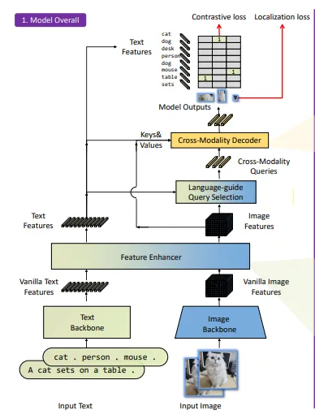

# Comparative Evaluation of YOLO and SAM+GroundingDINO for Aimbot Development in Valorant: A Computer Vision Perspective

**Members:**
Arbër Demi 5073227
Akash Amalan 4682505

### Introduction

Aim bots, an intersection of artificial intelligence (AI) and gaming, represent an intriguing area of study. Their study unveils innovative algorithms, novel training methodologies, and enhanced performance in intricate gaming environments. On a different note, the use of aim bots often leads to unfair gaming practices, which prompts the necessity of exploring this domain to ensure ethical gaming experiences.

Existing solutions for automated gameplay primarily rely on metadata acquired directly from the game. However, this approach lacks creativity and diversity in operations, as it mainly revolves around the basic change of mouse positioning. Enter the world of computer vision - with AI models like YOLO ("You Only Look Once") making strides in object detection. But can we do better? To answer this question, we aim to develop a model combining the capabilities of SAM (Segment Anything Model) and GroundingDINO, and compare its performance with the renowned YOLO model.

We chose Valorant, a popular first-person shooter game by Riot Games, as our testbed due to its dynamic environment and vast user base. Our model targets enemy heads and bodies to evaluate its performance.

### Methodology


Our prime objective is to examine how the combined SAM+GroundingDINO model stacks up against the traditional YOLO model. SAM, an object segmentation model developed by Meta, coupled with GroundingDINO, a zero-shot object detection model, is a promising combination. We hypothesize that this could provide improved accuracy and robust behavior masking for vision-based bots.


For our experiment, we leveraged pre-annotated labels and training/test images from publicly available datasets on Roboflow. These datasets include:

- [Valorant Object Detection](https://universe.roboflow.com/valorantobjectdetection/valo-1h0lc)
- [Project Valorant](https://universe.roboflow.com/project-nqyj3/valorant-f3198)
- [Santyasa Dataset](https://universe.roboflow.com/alfin-scifo/santyasa/dataset)

In the following sections, we will detail how these datasets were utilized for training and validating our models.


### Resources
The experiments were done on two separate CPUs and GPUs. 

| Experiment Model       | CPU                   | GPU |
|------------------------|-----------------------| --- |
| **YOLO**                   | Intel Core I5 12-600k | NVIDIA RTX 3070 |
| **Grounding Dina and SEM** | Intel Core I9 12-900k | NVIDIA RTX 3070TI |


### Datasets
Each dataset comes with a training set, validation set, and testing set. The images are provided in JPEG format, while the labels for each set are stored in separate text files. 

The label format is as follows:

`2 0.234375 0.47716346153846156 0.03125 0.040865384615384616`

`1 0.2644230769230769 0.5685096153846154 0.08173076923076923 0.11298076923076923`

Here, the first integer indicates the class, and the rest of the numbers represent the coordinates of the bounding box. Each label set thus provides crucial information for the models to correctly identify and locate the objects within the images.
the first integer represents the class and the rest of the coordinates of the bounding box. 

Do note that all these datasets contain different labels with different quality of images. Here are some random examples of all 3 datasets.

<h2 align="center">Dataset 1</h2>
<div align="center">
<table>
  <tr>
    <td align="center"><br /><sub><b>Image 1</b></sub></td>
    <td align="center"><br /><sub><b>Image 2</b></sub></td>
    <td align="center"><br /><sub><b>Image 3</b></sub></td>
  </tr>
  <tr>
    <td align="center"><br /><sub><b>Image 4</b></sub></td>
    <td align="center"><br /><sub><b>Image 5</b></sub></td>
    <td align="center"><br /><sub><b>Image 6</b></sub></td>
  </tr>
  <tr>
    <td align="center"><br /><sub><b>Image 7</b></sub></td>
    <td align="center"><br /><sub><b>Image 8</b></sub></td>
    <td align="center"><br /><sub><b>Image 9</b></sub></td>
  </tr>

</table>
</div>


<br>
<br>

<h2 align="center">Dataset 2</h2>


<div align="center">
<table>
  <tr>
    <td align="center"><br /><sub><b>Image 1</b></sub></td>
    <td align="center"><br /><sub><b>Image 2</b></sub></td>
    <td align="center"><br /><sub><b>Image 3</b></sub></td>
  </tr>
  <tr>
    <td align="center"><br /><sub><b>Image 4</b></sub></td>
    <td align="center"><br /><sub><b>Image 5</b></sub></td>
    <td align="center"><br /><sub><b>Image 6</b></sub></td>
  </tr>
  <tr>
    <td align="center"><br /><sub><b>Image 7</b></sub></td>
    <td align="center"><br /><sub><b>Image 8</b></sub></td>
    <td align="center"><br /><sub><b>Image 9</b></sub></td>
  </tr>

</table>
</div>

<br>
<br>

<h2 align="center">Dataset 3</h2>


<div align="center">
<table>
  <tr>
    <td align="center"><br /><sub><b>Image 1</b></sub></td>
    <td align="center"><br /><sub><b>Image 2</b></sub></td>
    <td align="center"><br /><sub><b>Image 3</b></sub></td>
  </tr>
  <tr>
    <td align="center"><br /><sub><b>Image 4</b></sub></td>
    <td align="center"><br /><sub><b>Image 5</b></sub></td>
    <td align="center"><br /><sub><b>Image 6</b></sub></td>
  </tr>
  <tr>
    <td align="center"><br /><sub><b>Image 7</b></sub></td>
    <td align="center"><br /><sub><b>Image 8</b></sub></td>
    <td align="center"><br /><sub><b>Image 9</b></sub></td>
  </tr>

</table>
</div>

<h2 align="center">Dataset 4</h2>

Our final dataset is a video that showcases the performance of real-time detection in action. This video features a streamer (TenZ) practicing in the in-game shooting range. In this scenario, enemies spawn in rapid succession and must be neutralized before they disappear.

<p align="center">

</p>
To facilitate our evaluation, we annotated all frames in which an enemy appears with dots centering on the enemy's head and body, as illustrated below:

<p align="center">

</p>
During detection moments, we took the initiative to reduce on-screen clutter by whiting out the camera and the ad banner in the images.
The use of these points will be detailed further in the online evaluation section.


#### Comparison

It is apparent that dataset 1 has high quality images while dataset 2 and 3 has low quality in-game images. One can decide to remove some of the images
of dataset 1 and 2 due to its resolution. However, we approach this differently for both Yolo and GroundingDino with SIEM as we will explain in the next sections.

## Yolo

YOLO, short for "You Only Look Once," has revolutionized the field of computer vision with its state-of-the-art, real-time object detection system. Its unique approach to processing images in a single forward pass while achieving high accuracy has positioned it as a frontrunner for object detection tasks.

The principle underlying YOLO is refreshingly simple. Traditional object detection systems propose multiple regions within an image as potential objects and classify them independently. This method, while effective, can be computationally taxing and slow. YOLO, however, transforms this task into a single regression problem. It divides the image into a grid and assigns each cell within this grid the responsibility of predicting a defined number of bounding boxes and class probabilities.

Each cell within the grid predicts multiple bounding boxes and their associated confidence scores. These scores reflect both the model's confidence in the presence of an object within the box and the accuracy of the predicted box. Each bounding box is characterized by five predictions: x, y, w, h, and confidence. The coordinates (x, y) denote the center of the box relative to the grid cell's boundaries, while width (w) and height (h) are predicted relative to the entire image. The confidence prediction denotes the Intersection over Union (IoU) between the predicted box and any ground truth box.

Simultaneously, each grid cell predicts conditional class probabilities for each class. The conditional class probability is the probability of a detected object belonging to a particular class. The final score for each bounding box is computed as the product of the box's confidence and the conditional class probability. Any bounding box with a final score below a certain threshold is discarded. Through this unified detection scheme, YOLO achieves significant speed while maintaining competitive object detection performance, eliminating the need for various pre-processing stages and establishing a highly effective and efficient method for object detection.

The YOLO architecture is an ensemble of simplicity and effectiveness. It employs a single Convolutional Neural Network (CNN) that processes an entire image as input and predicts bounding boxes and class probabilities directly from the image in a single pass. The backbone of this network consists of 24 convolutional layers followed by 2 fully connected layers. Inspired by the GoogLeNet model for image classification, YOLO replaces the inception modules used in GoogleNet with straightforward 1x1 reduction layers followed by 3x3 convolutional layers. The earlier layers of the network function like a conventional CNN, ending with fully connected layers that serve as a classifier.

The final output from the YOLO architecture is a tensor of shape (S, S, B*5 + C), where S x S represents the number of grid cells the image is divided into, B stands for the number of bounding boxes each cell predicts, and C signifies the number of classes. For each bounding box, the model outputs five properties: x, y coordinates of the box center, width and height of the box, and a confidence score.

An intriguing aspect of YOLO's architecture is that it processes the entire image during the training phase. This approach allows YOLO to implicitly encode contextual information about classes and their appearance, equipping it with superior capabilities when detecting objects of varying sizes and settings, thereby enhancing its generalization ability over numerous object detection models.

In its newer versions, YOLO's architecture has been improved to incorporate features like skip connections and upsampling. These features assist in detecting smaller objects. The final layer now also utilizes anchor boxes to refine bounding box predictions for objects of diverse shapes. Consequently, each version of YOLO continues to evolve and improve on its architecture, making it both faster and more accurate.

### YOLO Versions and Variants: Choosing the Right One for Our Project

Navigating through the diverse landscape of object detection algorithms, one cannot miss the dynamism and robustness of YOLO (You Only Look Once)[1]. Known for its speedy real-time inference, YOLO has seen multiple iterations, each carving a niche for itself with unique capabilities and optimizations.

The spotlight often falls on YOLOv3, a common choice among researchers and developers alike. However, the YOLO universe doesn't stop there. The emergence of newer versions like YOLOv7 and YOLOv8 underscores continuous innovations in the pursuit of faster and more efficient real-time object detection[1].

For this project, our journey led us to YOLOv5, an intriguing balance between performance and computational resource consumption. But the YOLOv5 story isn't one-size-fits-all, with different variants ('s', 'm', 'l', and 'x') offering a spectrum of speed and accuracy trade-offs[2].

- The 's' variant, being the smallest and fastest, tempts with high speed but at the expense of accuracy.
- The 'm' variant, our chosen companion for this endeavor, strikes a harmonious balance between speed and accuracy.
- The 'l' and 'x' variants, on the other end of the spectrum, offer higher accuracy but at the cost of slower inference speed.

The choice of the 'm' model wasn't random[2]. It emerged as the optimal solution considering:

1. **Computational Resources**: The 'm' variant adeptly balances computational efficiency and accuracy. While the 'l' and 'x' could have offered higher accuracy, their larger computational appetite wouldn't fit the bill for our use-case.
2. **Real-Time Performance**: With our application deeply rooted in the fast-paced dynamics of Valorant gameplay, maintaining real-time performance was paramount. The 'm' variant checked this box effectively.
3. **Dataset Complexity**: Our datasets brought with them their own set of challenges, with varying complexities and quality. The 'm' model showcased its robustness in handling diverse image resolutions and noise levels.

Remember, the choice of the model variant significantly hinges on your specific use case and available resources. If your priority is high accuracy and computational resources aren't a constraint, the larger 'l' or 'x' models might just be your ideal match. However, for this project, 'm' proved to be our optimal partner.
This is the overall architecture of Yolo5m:

<p align="center">
  
</p>


#### Training and Validation: Harmonizing Datasets and Embracing Diversity

For training YOLO, we utilized all three distinct datasets, each with its unique characteristics but adhering to a consistent format. The quality of images within these datasets varied, as did the labels they utilized.

All datasets encompassed `EnemyHead` and `EnemyBody` labels, which were our primary focus for this study. However, they also contained additional labels such as `BoomBot` and other game-specific abilities. These extra labels, although interesting, did not align directly with our current objective.

To achieve a streamlined training process, we undertook the task of re-labeling these datasets. 
This harmonization allowed us to align the data more closely with our goal.
We adopted the following label convention: `['boomybot', 'enemyBody', 'enemyHead', 'smoke', 'splat', 'teammate', 'walledoff enemy']`. 
This decision was guided by the inner workings of YOLO. 

YOLO operates based on class predictions rather than class names, translating our meticulously chosen labels into a plain numerical list: `[0, 1, 2, 3, 4, 5, 6, 7]`. Through our re-labeling effort, we ensured that every class number correctly corresponded to its respective label across all datasets.

One might question our decision to use a wide range of image qualities, rather than solely high-resolution images or curating a pruned selection. The answer lies in the trade-off between quality and diversity. Incorporating images of varying quality level challenged YOLO's ability to interpret images under different conditions. 
This not only enriched our training data but also aimed to enhance YOLO's generalization performance on the test set,
crafting a more robust model ready to tackle different angles one might encounter in Valorant. Therefore all 3 datasets was merged into one
and used for training the Yolo model.

##### Process and Commands
The training process is initiated through a command-line interface, which accepts a set of parameters: the image size, batch size, number of epochs, a data.yaml file specifying the dataset configuration, the chosen model, and the weights.

The data.yaml file is a fundamental piece that provides details about the data being used. An example of this file might look like this:

```yaml
path: datasets/dataset2
train: train/images
val: valid/images
test: test/images
nc: 7
names: ['boomybot', 'enemyBody', 'enemyHead', 'smoke', 'splat', 'teammate', 'walledoff enemy']
```

In this YAML file, we specify the path of our dataset, the locations of the training, validation, and testing images, the number of classes (`nc`), and the names of these classes.

The validation process follows a similar structure and is run using the following command:

```shell
python val.py --weights ../best.pt --data valorant.yaml --img 416
```

Finally, the testing process is also similar but requires an additional source parameter indicating the path to the testing dataset, and a confidence threshold for the bounding boxes. It can be executed using the following command:

```shell
python detect.py --weights ../best.pt --img 640 --conf 0.25 --source datasets/dataset1/test/images
```
This structure allows for a great deal of flexibility and customization in the training, validation, and testing processes, accommodating various types of data configurations and use cases.

For validation a similar command is used:
```
python val.py --weights ../best.pt --data valorant.yaml --img 416
```

For testing also a similar command is used
```
python detect.py --weights ../best.pt --img 640 --conf 0.25 --source datasets/dataset1/test/images
```
Except you need a provide an extra source with the path to the test dataset and a confidence for the bounding boxes. 


#### Hyperparameter Tuning:


To fine-tune the model, we used an evolutionary approach. The fitness of the model, which we aim to maximize, is defined by a weighted combination of metrics in YOLOv5. Specifically, mAP@0.5 contributes 10% of the weight, and mAP@0.5:0.95 provides the remaining 90%. Precision (P) and Recall (R) are not included.

The model is trained for 100 epochs with the evolutionary approach:

```bash
python train.py --epochs 100 --data dataset --weights yolov5m.pt --cache --evolve
```

Genetic operators such as crossover and mutation are primarily used during this evolution.

The final hyperparameters are as follows:

```yaml
lr0: 0.01                  # initial learning rate (SGD=1E-2, Adam=1E-3)
lrf: 0.2                   # final OneCycleLR learning rate (lr0 * lrf)
momentum: 0.937            # SGD momentum/Adam beta1
weight_decay: 0.0005       # optimizer weight decay 5e-4
warmup_epochs: 3.0         # warmup epochs (fractions ok)
warmup_momentum: 0.8       # warmup initial momentum
warmup_bias_lr: 0.1        # warmup initial bias lr
box: 0.05                  # box loss gain
cls: 0.5                   # cls loss gain
cls_pw: 1.0                # cls BCELoss positive_weight
obj: 1.0                   # obj loss gain (scale with pixels)
obj_pw: 1.0                # obj BCELoss positive_weight
iou_t: 0.20                # IoU training threshold
anchor_t: 4.0              # anchor-multiple threshold
fl_gamma: 0.0              # focal loss gamma (efficientDet default gamma=1.5)
hsv_h: 0.015               # image HSV-Hue augmentation (fraction)
hsv_s: 0.7                 # image HSV-Saturation augmentation (fraction)
hsv_v: 0.4                 # image HSV-Value augmentation (fraction)
degrees: 0.0               # image rotation (+/- deg)
translate: 0.1             # image translation (+/- fraction)
scale: 0.5                 # image scale (+/- gain)
shear: 0.0                 # image shear (+/- deg)
perspective: 0.0           # image perspective (+/- fraction), range 0-0.001
flipud: 0.0                # image flip up-down (probability)
fliplr: 0.5                # image flip left-right (probability)
mosaic: 1.0                # image mosaic (probability)
mixup: 0.0                 # image mixup (probability)
copy_paste: 0.0            # segment copy-paste (probability)
```

These hyperparameters determine the behavior of the training process and significantly 
influence the model's performance. Fine-tuning these parameters is an essential part of computer vision
pipeline to ensure optimal performance of the model on the task at hand.

---

### GroundingDINO and SAM [2][3]

<p align="center">
  
</p>

#### Description
GroundingDINO is a novel zero-shot object detection model that has great performance in existing datasets.
It is a combination of many different sections coming together to make a great framework mainly used for annotation
and segmentation, in conjunction with SAM.

SAM(Segment Anything Model) is a recent AI model developed by Meta. It focuses on image segmentation
and in conjunction with GroundingDINO, it makes for a nice pipeline to detect and create masks for objects 
in view.

For more information on this specific use case of GroundingDINO and SAM, this Medium article does a great job at giving 
more information: https://pub.towardsai.net/grounding-dino-achieving-sota-zero-shot-learning-object-detection-78388d6842ed.
It is also the source of the architecture image shown above.
#### Annotations
The annotations of the datasets we used are not very compatible with GroundingDINO and SAM. The annotations are small boxes which fit well with the detection style of YOLO and are seemingly annotated with that in mind.
However, we had trouble getting GroundingDINO to get a similar detection style, simply because it does not use the same grid system that YOLO uses, and the textual prompts trying to isolate some areas do not work well all the time.

The annotations were specifically made for two labels: "Head" and "Person".

To make sure that the datasets were useful for both sides, we manually annotated the datasets, except for the third one as it was too noisy to make consistent decisions on annotating.
For this annotation procedure we used labelme (the package can be installed through pip), and manually annotated boxes that would fit GroundingDINOs detection style.
Some examples of this annotation can be seen below:

<p align="center">


<p>

<p align="center">


<p>

To make the annotations usable for training and evaluation, they had to be converted to a format that we were already using.
The steps shown at https://github.com/Tony607/labelme2coco were followed to turn the annotations into COCO data formatted JSON.
#### Training

As GroundingDINO is fairly new (March 2023), the training pipeline for it is not released yet. With the resources
available online, at the moment we are only able to change our labels and tune some thresholds.

When it comes to labels, DINO can handle complex label prompts such as "man sitting on a chair", however it has a lot 
of false positives when it comes to objects that it is not properly tuned for. This was made apparent quite quickly when 
we started to mess around with labels as results would change even depending on what other labels were included, for 
example, some false positives for the label "head" would disappear if the model was also prompted to detect "shoe". This
had something to do with the confidence thresholds in-place, however the exact reason for these changes is still a bit 
unclear.

The biggest influence when it comes to detection was coming from the text and box confidence threshold parameters.
These are passed to the model before it does detections to decide what is good enough as a detection. How we decided
on what is a best threshold was with a simple search with MAP evaluation on the first dataset (the best performing thresholds were chosen).
This search was done using different combinations of box and text thresholds, with a range from 0.05 to 0.45 (thresholds higher than 0.45 were eliminating too many clear cases)
In the end, the best performing cases were around 0.4 to 0.45, however there were many more cases with no detections.
So instead we settled on 0.35 for both with an MAP of 0.803, as it detected nearly all cases.


### Offline Evaluation

The key to any comparative study lies in its evaluation metrics. We use Mean Average Precision (MAP), Precision, Recall, and F1 score as our key metrics to evaluate the performance of the models 
only on the images from the datasets(not videos):

- **Precision** is the ratio of correctly predicted positive observations to the total predicted positives.
- **Recall** (Sensitivity) calculates the ratio of correctly predicted positive observations to the all observations in actual class.
- **F1 Score** is the weighted average of Precision and Recall. It tries to find the balance between precision and recall.
- **MAP** (Mean Average Precision) is used in information retrieval to measure the effectiveness of the model in terms of precision of retrieval over a range of recall values.

Do note that **accuracy** was not considered due to the several reasons:
 -  The number of pixels representing the object (foreground) can be much smaller than the pixels representing the background. In such cases, a model that only predicts the background would still have a high accuracy, despite failing to detect any objects. 
 -  Accuracy doesn't account for localization errors. A model may correctly identify the presence of an object but inaccurately define its boundaries or location. Accuracy would still consider this a correct prediction, even though the location is wrong.
 -  Multiple Objects: In scenarios where multiple instances of an object can exist in a single image, accuracy as a metric falls short. If a model fails to detect one of several objects, the accuracy might still be high despite the missed detection.
 -  Precision and Recall Tradeoff: Accuracy doesn't account for the tradeoff between precision (how many selected items are relevant) and recall (how many relevant items are selected). In some contexts, it may be more important to prioritize one over the other.

### Online Evaluation
In the fast-paced world of online gaming, real-time performance is critical. We're testing our system on two key parameters – accuracy in head classification and inference speed.
For accuracy, we're using annotated videos from Dataset 4, comparing our system's detection with ground truth frames. It's a real-time check on whether our system accurately recognizes heads in live gaming.
For speed, we're timing how quickly our model predicts based on each frame. We also account for any target movement during this prediction time.
So, we're essentially striving to ensure our system can accurately and swiftly detect dynamic movements in live game feeds.

### Expected Outcomes

Through this experiment, we aim to answer the following questions:

- How does YOLO compare to SAM+GroundingDINO for  metrics: MAP, recall, precision, F1 score?
- What hyperparameters need to be tuned between the two models?
- How well does the model react to dynamic movements in the online game feed?
- Can SAM+GroundingDINO outperform YOLO in a dynamic first-person shooter game like Valorant?

Our study aims to shed light on the applications of advanced computer vision techniques in gaming, specifically first-person shooters. By comparing different object detection architectures, we hope to contribute to the ongoing development of fair and ethical gaming practices.

### Results

#### Yolo
The results for Yolo for both offline performance and online performance are presented below

##### Offline performance

###### Sample Predictions 

Before diving into diving metrics, it is nice to look at  sample predictions in a batch from yolo.

<p align="center">
    <b>Ground Truth</b><br>
    
</p>

<p align="center">
    <b>Predictions</b><br>
    
</p>

At first glance, it seems the Yolo was successfully able to predict perfectly from this batch. However, it is not 
100% perfect, we have some interesting cases from different and presented below:

|  |  |  |
|:---:|:---:|:---:|
|  |  |  |


As we delve into the intricacies of yolo's behavior, we uncover fascinating quirks in its operation. Take, for instance, occasions when the model tags a firearm as the body of an adversary or even overlooks an enemy situated directly in front of the player. These scenarios provide a tantalizing glimpse into the thin line our model treads between correct and incorrect identification.

###### Metrics 
Table I

| Class       | Images | Instances |    P    |    R    | mAP50  | mAP50-95 | F1-score(threshold = 0.5) |
|-------------|--------|-----------|---------|---------|--------|----------|---------------------------|
| all         |  243   |   541     |  0.924  |  0.872  | 0.911  |  0.57    | 0.79                      |
| enemyBody   |  243   |   252     |  0.978  |  0.968  | 0.984  |  0.702   | 0.94                      |
| enemyHead   |  243   |   289     |  0.87   |  0.775  | 0.838  |  0.438   | 0.83                      |

In this table, "Class" refers to the object being detected, "Images" is the number of images used, 
"Instances" is the number of instances the class appeared in the dataset, "P" is precision, "R" is recall, 
"mAP50" is mean average precision at 50% Intersection over Union (IoU) and
"mAP50-95" is mean average precision at IoU from 50% to 95%.


It is apparent from the high precision and recall for enemyBody shows that it can in most realisitc cases 
be able to draw the correct bounding boxes. It is also apparent that it is much easier to detect the enemyBody than the 
head which is something that we would expect. Nonetheless, this model performs very well in detecting enemyHead, in more than 75%
of the cases the head is correctly recognized in the validation set as the metrics mAP and F1-score reveal at a threshold
or confidence of 0.5.


The graphs below show the precision recall , Recall-confidence , precision-confidence  and f1-confidence curves.

|  |  |
|:---:|:---:|
|  |  |


#### GroundingDINO and SAM

The results for GroundingDINO and SAM are with respect to their offline performance on dataset 1 + 2, and also the 
online performance on dataset 4.

##### Offline performance

Table I

|    Class    |   MAP   |   AP    | Recall  | Precision | F1_Score |
|:-----------:|:-------:|:-------:|:-------:|:---------:|:--------:|
|    Head     | 0.62811 | 0.32946 | 0.27487 |  0.67112  | 0.39001  |
| Person/Body | 0.62811 | 0.92677 | 0.49863 |  0.97919  | 0.66077  |

At first glance, the most noticeable thing is the disparity between the AP (Average Precision) between the Head and Person/Body classes.
DINO was much better at detecting the general body, which is understandable as the head has less detail and is generally
harder to detect due to the smaller amount of pixels.
The model in general has low recall but higher precision, while overall not a great performance, much less than we expected.

In the pictures below you can see some examples of the annotations (on the left) and predictions of DINO + masking of SAM(on the right).
<p align="center">


<p >

<p align="center">


<p >

##### Online performance

When it comes to online performance, our main measure is delay during the real-time detection.

Sadly, GroundingDINO and SAM performed quite poorly.
The average delay of detecting object per frame was around 1.11202 seconds. That is a very long time, even for a 30 FPS video.
In a real gaming environment, FPS in shooter games is quite important, and having a bot that can shoot every 65 frames or so
if the gaming is running at 60 FPS, is quite bad. This performance was slightly improved when SAM was taken out of the picture,
however DINO on its own was still slow.

Despite this, when it comes to accuracy it performed similarly to the offline setting in general accuracy, having difficulty 
with the Head class and consistently detecting the Person/Body class with a slight boost, due to less distance from the 
camera to the enemies in the shooting range.

The exact values for MAP, AP, Recall, Precision and F1_Score were not calculated due to the video not having any annotations
for the boxes (the rest of the annotation took a considerable amount of time).


## Discussion

The results we got from this study were not what we were expecting, however we do believe to have shown some clear differences between 
GroundingDINO + SAM and YOLO. 

Although we expected GroundingDINO to perform worse in the task of object detection due to the inability to train it properly compared to 
YOLO, we did not expect the issues with real-time detection spawning from the computational demands it has. 
Because of the slow speed, it cannot be properly used for real-time object detection in the context of first-person shooters (running on single GPUs).

However, there could be other factors that have affected the speed of the computations.
https://github.com/BowMonk/valoCV/assets/43303509/75a7e672-ddf6-4640-8ebc-c43cddbb9a60

We did not tinker much with the extra operations that GroundingDINO is doing under the hood, as the model is quite complex and would require
quite some time to properly change.
For a proper application of this, DINO+SAM could be running on multiple GPUs, however that seems quite an investment for something that could 
be achieved through other models(YOLO) with more accuracy and speed. 

We tried to make the procedure of annotation readings (for the dots) as fast as possible to reduce load, however we noticed that it did not affect
the overall speed, as on its own it ran with no visible delay.

In the end, YOLO seems to remain the most efficient way to conduct real-time object detection, and specifically in first person shooters.

### Future work and things we couldn't wrap up

The main thing we were hoping would separate DINO+SAM from YOLO, would be the use of the segmentation masks from SAM to create some noise in 
the aiming input of a bot. This would make the aiming feel more natural, as current metadata scraping bots are quite "robotic" in their actions.
With the possibility of using the bounds of the segmentation mask as constraints for noise distribution edges, this could create some more "believable" bots.

However, seeing the performance of DINO, we are unable to properly make do this study, as it would take a long time to analyse the difference between a point
and click approach, and a noise addition through the proposed pipeline.


Throughout this study we have however come up with a (possibly) better suggestion that fits the use case of all the mentioned models better.
We could use GroundingDINO for automatic annotation of data, which will then be used to train YOLO for increased object detection performance, and later adapting SAM to work with
the object detections from YOLO instead.

The segmentation masks should work the same, however the textual prompt functionality that works so well with DINO might not be a possibility anymore.


<video src="https://github.com/BowMonk/valoCV/assets/43303509/8bfb4fc6-93cc-4cf3-8456-eaefb237198f" controls="autoplay loop" style="max-width: 730px;">
</video>


## Tags
`#ComputerVision` `#AI` `#ML` `#YOLO` `#GroundingDINO` `#SAM` `#Valorant` `#Aimbot`

**References**

[1] Redmon, Joseph & Divvala, Santosh & Girshick, Ross & Farhadi, Ali. (2016). You Only Look Once: Unified, Real-Time Object Detection. 779-788. 10.1109/CVPR.2016.91.
