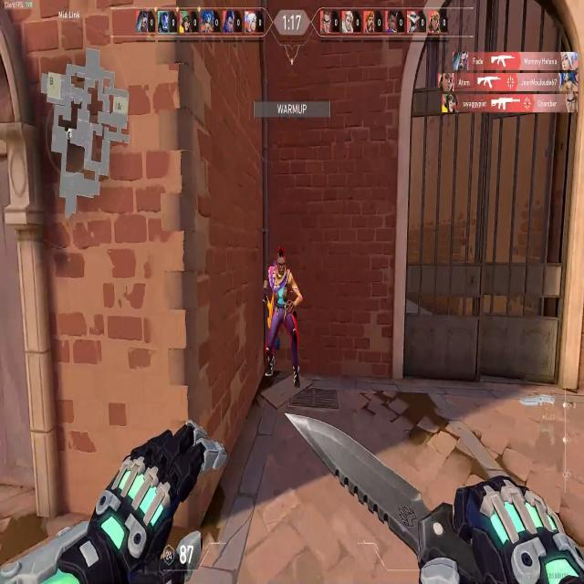

# Comparative Evaluation of YOLO and SAM+GroundingDINO for Aimbot Development in Valorant: A Computer Vision Perspective

**Members:**
Arbër Demi 5073227
Akash Amalan 4682505

### Introduction

Aim bots, an intersection of artificial intelligence (AI) and gaming, represent an intriguing area of study. Their study unveils innovative algorithms, novel training methodologies, and enhanced performance in intricate gaming environments. On a different note, the use of aim bots often leads to unfair gaming practices, which prompts the necessity of exploring this domain to ensure ethical gaming experiences.

Existing solutions for automated gameplay primarily rely on metadata acquired directly from the game. However, this approach lacks creativity and diversity in operations, as it mainly revolves around the basic change of mouse positioning. Enter the world of computer vision - with AI models like YOLO ("You Only Look Once") making strides in object detection. But can we do better? To answer this question, we aim to develop a model combining the capabilities of SAM (Segment Anything Model) and GroundingDINO, and compare its performance with the renowned YOLO model.

We chose Valorant, a popular first-person shooter game by Riot Games, as our testbed due to its dynamic environment and vast user base. Our model targets enemy heads and bodies to evaluate its performance.

### Methodology

Our prime objective is to examine how the combination of SAM+GroundingDINO fares against the conventional YOLO model. SAM (developed by Meta) is an object segmentation model, whereas GroundingDINO is a zero-shot object detection model. This combination, we believe, can provide enhanced robustness in accuracy and behavior masking to vision-based bots.
For our experiment, we used pre-annotated labels and training/test images from roboflow publicly available datasets
:https://universe.roboflow.com/valorantobjectdetection/valo-1h0lc, https://universe.roboflow.com/project-nqyj3/valorant-f3198, 
https://universe.roboflow.com/alfin-scifo/santyasa/dataset.   In the upcoming section we will explain how we used
these datasets for training and validation.

#### Datasets
Do note that all these datasets contain different labels with different quality of images. Here are some random examples of all 3 datasets that was used to train Yolo

<h2 align="center">Dataset 1</h2>

<table>
  <tr>
    <td align="center"><a href="#"> <b>Image 1</b></a></td>
    <td align="center"><a href="#"> <b>Image 2</b></a></td>
    <td align="center"><a href="#"> <b>Image 3</b></a></td>
  </tr>
  <tr>
    <td align="center"><a href="#"> <b>Image 4</b></a></td>
    <td align="center"><a href="#"> <b>Image 5</b></a></td>
    <td align="center"><a href="#"> <b>Image 6</b></a></td>
  </tr>
  <tr>
    <td align="center"><a href="#"> <b>Image 7</b></a></td>
    <td align="center"><a href="#"> <b>Image 8</b></a></td>
    <td align="center"><a href="#"> <b>Image 9</b></a></td>
  </tr>

</table>

 
 

<h2 align="center">Dataset 2</h2>

<table>
  <tr>
    <td align="center"> <b>Image 1</b></a></td>
    <td align="center"> <b>Image 2</b></a></td>
    <td align="center"> <b>Image 3</b></a></td>
  </tr>
  <tr>
    <td align="center"> <b>Image 4</b></a></td>
    <td align="center"> <b>Image 5</b></a></td>
    <td align="center"> <b>Image 6</b></a></td>
  </tr>
  <tr>
    <td align="center"> <b>Image 7</b></a></td>
    <td align="center"> <b>Image 8</b></a></td>
    <td align="center"> <b>Image 9</b></a></td>
  </tr>

</table>

 
 

<h2 align="center">Dataset 3</h2>

<table>
  <tr>
    <td align="center"> <b>Image 1</b></a></td>
    <td align="center"> <b>Image 2</b></a></td>
    <td align="center"> <b>Image 3</b></a></td>
  </tr>
  <tr>
    <td align="center"> <b>Image 4</b></a></td>
    <td align="center"> <b>Image 5</b></a></td>
    <td align="center"> <b>Image 6</b></a></td>
  </tr>
  <tr>
    <td align="center"> <b>Image 7</b></a></td>
    <td align="center"> <b>Image 8</b></a></td>
    <td align="center"> <b>Image 9</b></a></td>
  </tr>

</table>

It is apparent that dataset 1 has high quality images while dataset 2 and 3 has low quality in-game images. One can decide to remove some of the images
of dataset 1 and 2 due to its resolution. However, we approach this differently for both Yolo and GroundingDino with SIEM.

### Yolo

### Offline Evaluation

The key to any comparative study lies in its evaluation metrics. We use Mean Average Precision (MAP), Precision, Recall, and F1 score as our key metrics to evaluate the performance of the models:

- **Precision** is the ratio of correctly predicted positive observations to the total predicted positives.
- **Recall** (Sensitivity) calculates the ratio of correctly predicted positive observations to the all observations in actual class.
- **F1 Score** is the weighted average of Precision and Recall. It tries to find the balance between precision and recall.
- **MAP** (Mean Average Precision) is used in information retrieval to measure the effectiveness of the model in terms of precision of retrieval over a range of recall values.

We run these evaluations both offline and online, with online evaluations conducted on live game feed to measure the inference time and reaction to dynamic movements. 

### Expected Outcomes

Through this experiment, we aim to answer the following questions:

- How does YOLO compare to SAM+GroundingDINO for general metrics like MAP, recall, precision, F1 score?
- What hyperparameters need to be tuned between the two models?
- How well does the model react to dynamic movements in the online game feed?
- Can SAM+GroundingDINO outperform YOLO in a dynamic first-person shooter game like Valorant?

Our study aims to shed light on the applications of advanced computer vision techniques in gaming, specifically first-person shooters. By comparing different object detection architectures, we hope to contribute to the ongoing development of fair and ethical gaming practices.

## Tags
`#ComputerVision` `#AI` `#ML` `#YOLO` `#GroundingDINO` `#SAM` `#Valorant` `#Aimbot`

**References**

[1] Redmon, Joseph & Divvala, Santosh & Girshick, Ross & Farhadi, Ali. (2016). You Only Look Once: Unified, Real-Time Object Detection. 779-788. 10.1109/CVPR.2016.91.
